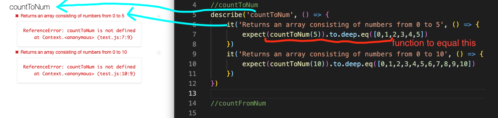

# JS GYM

## We are going to practice some algorithm problems using our knowledge of data structures, comparisons, if/else statements, arrays, and objects!

### remember to use references from our past lectures and online resources to help you!

Open each problems folder and you will see a file for each problem. The prompt for each problem is commented at the top of each file.

In order to check your solution, update the source of the script tag in your html to the js file in the problems folder. Open the index live server and you should see your js code in the console.

recommended order:
1. countToNum
1. countFromNum
1. fizzBuzz
1. stringReversal
1. numberOfVowels
1. separateNames
1. mostFrequentLetter
1. palindrome
1. calculator 
1. birthday
1. iterateBirthday
1. highestAverage
1. addAverageTestScores

## got through all of these? 
If you're feeling good checkout the problems in the extras folder! 

## Writing Tests? 
